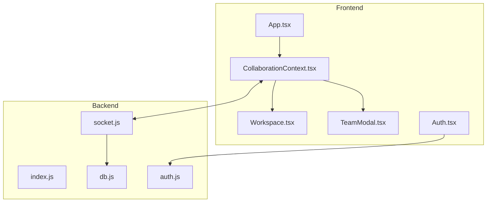

# Design Document: Collaboration Bug Fixes

## Overview

本设计文档描述了修复AI漫剧创作平台团队协作功能bug的技术方案。主要解决状态同步循环、数据不同步、权限验证、类型一致性、断线重连和内存泄漏等问题。

## Architecture

系统采用前后端分离架构：
- **前端**: React + TypeScript + Socket.io-client
- **后端**: Express + Socket.io + SQLite



## Components and Interfaces

### 1. CollaborationContext 改进

```typescript
interface CollaborationContextType {
  socket: Socket | null;
  role: Role;
  activeUsers: Collaborator[];
  members: Record<string, MemberInfo>; // 改进：包含完整成员信息
  currentUserId: string; // 新增：当前用户ID
  updateProject: (data: any) => void;
  updatePermission: (targetUserId: string, newRole: Role) => void;
  isConnected: boolean;
  isLoading: boolean; // 新增：加载状态
  projectData: ProjectData | null; // 新增：从服务器获取的项目数据
}

interface MemberInfo {
  id: string;
  name: string;
  email: string;
  role: Role;
}
```

### 2. 状态同步机制改进

```typescript
// 新增：更新来源标记
type UpdateSource = 'local' | 'remote';

// Workspace中的状态管理
const [updateSource, setUpdateSource] = useState<UpdateSource>('local');
const isRemoteUpdate = useRef(false);
```

### 3. Auth返回类型统一

```typescript
interface AuthUser {
  id: string;
  email: string;
  name: string;
  isAdmin: boolean; // 新增
}
```

## Data Models

### MemberInfo (改进)
```typescript
interface MemberInfo {
  id: string;
  name: string;
  email: string;
  role: Role;
  isOnline: boolean;
}
```

### ProjectState (服务器返回)
```typescript
interface ProjectState {
  members: Record<string, MemberInfo>;
  role: Role;
  projectData: {
    result: AnalysisResult | null;
    episodes: ScriptEpisode[];
    globalAssets: AnalysisResult | null;
  };
  projectInfo: {
    id: string;
    name: string;
    creator: string;
    description: string;
  };
}
```

## Correctness Properties

*A property is a characteristic or behavior that should hold true across all valid executions of a system-essentially, a formal statement about what the system should do. Properties serve as the bridge between human-readable specifications and machine-verifiable correctness guarantees.*

### Property 1: Sync Loop Prevention
*For any* sequence of updates (local or remote), the system should never broadcast more updates than the number of local changes made. Specifically, receiving a remote update should not trigger any broadcast.
**Validates: Requirements 1.1, 1.2, 1.4**

### Property 2: Project State Consistency
*For any* project state received from the server, the Workspace component's state should reflect that exact data after the update is processed.
**Validates: Requirements 2.2**

### Property 3: Member Identity Correctness
*For any* member list and current user, the "(我)" indicator should appear if and only if the member's ID equals the current logged-in user's ID.
**Validates: Requirements 3.1, 3.2**

### Property 4: Offline Member Name Display
*For any* offline member in the member list, their full name (not truncated ID) should be displayed.
**Validates: Requirements 3.3**

### Property 5: Authorization Enforcement
*For any* project update attempt, the server should reject the operation if the user is not a member of the project OR the user's role is 'viewer'.
**Validates: Requirements 4.1, 4.2**

### Property 6: User Data Consistency
*For any* successful login, the returned user object should contain all required fields (id, email, name, isAdmin), and these fields should be consistently used throughout the application.
**Validates: Requirements 5.1, 5.2, 5.3**

### Property 7: Cleanup on Unmount
*For any* component unmount, all intervals and timeouts created by that component should be cleared, and no callbacks should execute after unmount.
**Validates: Requirements 7.1, 7.2**

## Error Handling

1. **Socket连接错误**: 显示连接状态指示器，自动重连
2. **项目不存在**: 显示错误提示，重定向到首页
3. **权限不足**: 显示权限错误提示，阻止操作
4. **网络断开**: 显示离线状态，队列本地更新

## Testing Strategy

### 单元测试
- 使用 Vitest 作为测试框架
- 测试各组件的独立功能

### 属性测试
- 使用 fast-check 进行属性测试
- 每个属性测试运行至少100次迭代
- 测试标注格式: `**Feature: collaboration-bug-fixes, Property {number}: {property_text}**`

### 测试覆盖
1. CollaborationContext 状态管理
2. 权限验证逻辑
3. 用户数据一致性
4. 组件清理逻辑
